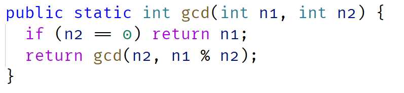

## GCD - Greatest Common Divisor OR HCF - Highest Common Factor

### Example:

n1 = 20, n2 = 12

#### Factors of n1

20 = 2 x 2 x 5

#### Factors of n2

12 = 2 x 2 x 3

#### Common Factors: 2 x 2 x 3 x 5 => 4

### GCD => 4

### Basic Euclidean Algorithm for GCD

#### The algorithm is based on the below facts.

    If we subtract a smaller number from a larger (we reduce a larger number), GCD doesn’t change. So if we keep subtracting repeatedly the larger of two, we end up with GCD.
    Now instead of subtraction, if we divide the smaller number, the algorithm stops when we find remainder 0.

## Source:

https://www.geeksforgeeks.org/euclidean-algorithms-basic-and-extended/

### LCM - Lowest Common Multiple

### Example:

n1 = 20, n2 = 12

#### Factors of n1

20 = 2 x 2 x 5

#### Factors of n2

12 = 2 x 2 x 3

#### Unique Factors: 2 x 2 x 3 x 5 => 60

### LCM => 4

# Formula: n1 x n2 = GCD(n1,n2) x LCM(n1, n2)

## One Approach to compute LCM can be using this formula

### First Calculate GCD using above method

#### Divide it with product of given numbers

## Another can be to find all the factors of given numbers

### and get the union of factors of both numbers

#### Their Product will be LCM

### Source:

GCD: https://www.geeksforgeeks.org/c-program-find-gcd-hcf-two-numbers/
LCM: https://www.geeksforgeeks.org/program-to-find-lcm-of-two-numbers/
