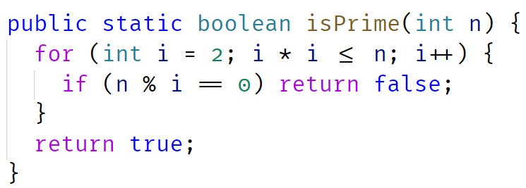
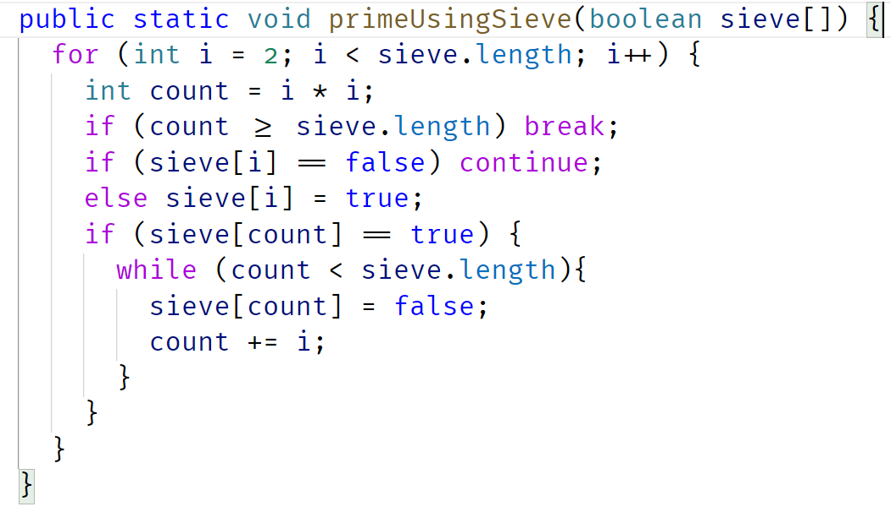

# Primality Test

## Question:

Given a positive integer, check if the number is prime or not. A prime is a natural number greater than 1 that has no positive divisors other than 1 and itself. Examples of first few prime numbers are 2, 3, 5.

## Examples:

Input: n = 11
Output: true

Input: n = 15
Output: false

Input: n = 1
Output: false

## Used Two Approaches

1st one is to iterate till square root of a given number

2nd one is to use Sieve of Eratosthenes Approach

